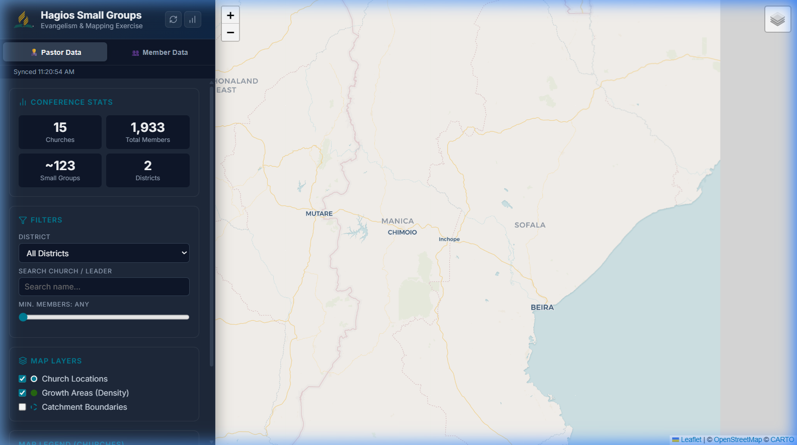
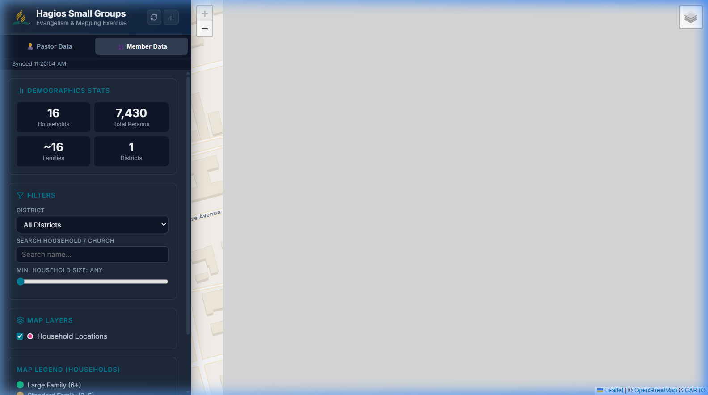
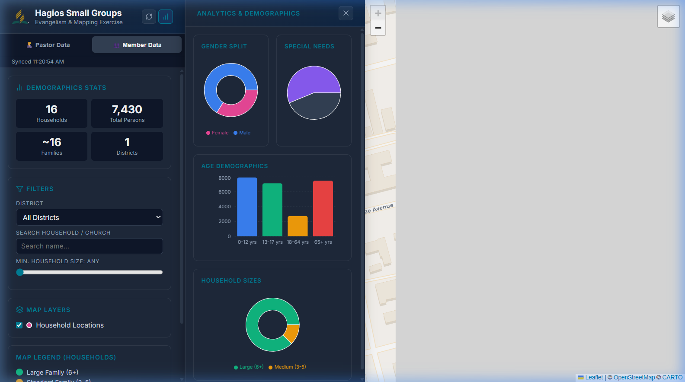
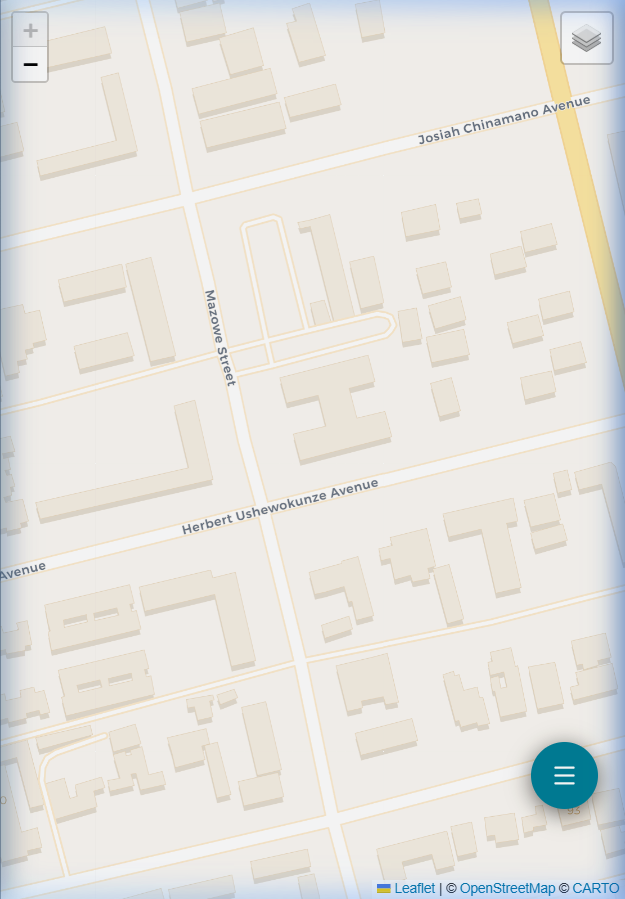
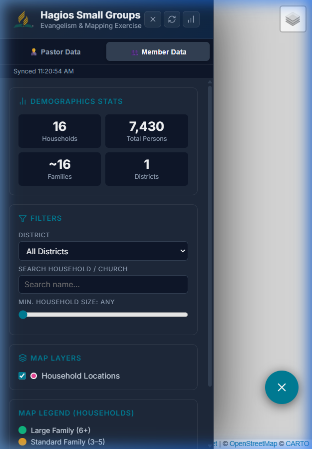

# Hagios Small Groups: User Manual

Welcome to the **Hagios Small Groups** dashboard. This tool is designed to help you visualize, analyze, and manage Seventh-day Adventist (SDA) congregations and member households through an interactive mapping interface.

---

## 1. Getting Started (Desktop)

The desktop dashboard is divided into three main areas:
- **Left Sidebar**: Controls for data views, filters, and map layers.
- **Center Map**: The interactive map showing locations.
- **Right Analytics (Optional)**: Detailed charts and demographic data.



### Data Views
You can toggle between two primary data modes:
- **👨‍💼 Pastor Data**: Focuses on church locations, member counts, and district organization.
- **👥 Member Data**: Focuses on individual households, family sizes, and specific community needs.

---

## 2. Searching and Filtering

Use the **Filters** card in the sidebar to narrow down the data:
- **District**: Filter by specific administrative districts.
- **Search**: Search by church name, leader name, or location.
- **Min. Members/Size**: Use the slider to filter by size (e.g., show only churches with >100 members).



---

## 3. Analytics and Demographics

Click the **Chart Icon** in the sidebar header to open the analytics panel. This provides a visual breakdown of:
- Members by Church.
- District distribution.
- Age and Gender demographics (in Member view).
- Special needs reporting.



---

## 4. Map Customization

### Map Layers
You can toggle different layers to change what is visible on the map:
- **Church/Household Locations**: Toggle the primary markers.
- **Growth Areas (Heatmap)**: See density of members.
- **Catchment Boundaries**: See the geographical reach of churches.

### Base Map Selection
In the top-right corner of the map, click the layer icon to switch between:
- **Standard Map**: High-contrast, easy-to-read map.
- **Google Hybrid**: Satellite imagery combined with road labels for better real-world context.

---

## 5. Mobile Usage

The application is fully optimized for mobile devices.

### Navigation
- **Floating Menu Button**: Located in the bottom right. Tap it to open the sidebar.
- **Map View**: The map takes up the full screen for easy navigation.

````carousel

<!-- slide -->

````

---

## 6. Interactive Group Manager

Click the **Interactive Group Manager** button at the bottom of the sidebar to open a detailed list view. This allows you to explore the data in a searchable, accordion-style list, perfect for quick reference.
